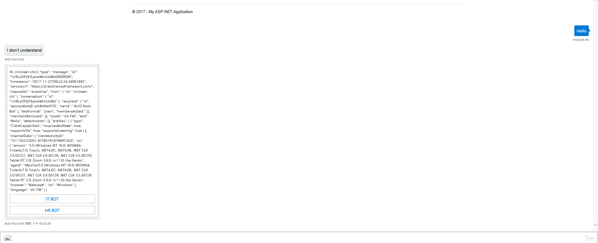
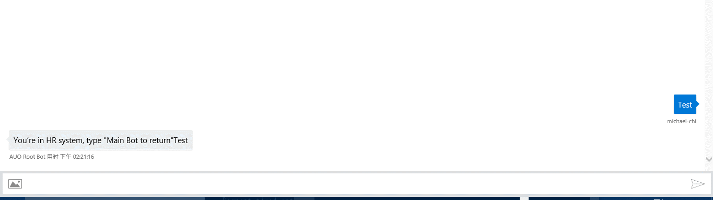
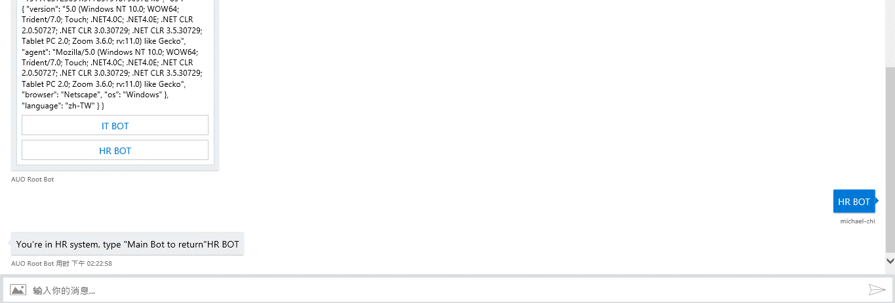

## Bot-to-Bot Handover

This document introduces how to implement Bot-to-Bot handover in Microsoft Bot Framework. A typical Bot-to-bot scenario such as Alexa and its Skills. A "root bot" (Alexa) handling conversation with end users, when certain keyword are triggered, the "root bot" redirect user messages to corresponding backend "expert bot" to assist end users.

### How to use

In this document, we will be providing working sample codes that illustrate how to implement a "root bot" that accept user messages and provide a list of integrated backend "expert bot". When use select a expert bot he wants to communicate with, the "root bot" forward all following messages to the backend "expert bot". User can then use a pre-defined "keyword" to return to "root bot"

This document is intending to provide instruction for enterprises to create their internal bot consumed by internal users via WebChat control. Some codes or considerations may not fit to consumer bot scenario. 3rd party IM app such as Skype, Facebook messengers…etc may not be able to use in this scenario.

We assume you have basic Microsoft Bot Frmaework knowledge including how to register Bot in Bot Framework portal and how to develop a Bot.

### Architecture

Below illustrate high-level architecture

1. Root bot sitting in DMZ where Bot Connector Service can access to it via internet
2. Expert Bots (HR Bot, FIN Bot…etc) sitting in intranet where Root Bot has access to.
3. User first talk to Root Bot, when he wants to talk to HR Bot, Root Bot forward incoming messages to backend Expert Bot.

 ![](data:image/*;base64,iVBORw0KGgoAAAANSUhEUgAAAcgAAAEhCAMAAAG7M/AEAAAAAXNSR0IArs4c6QAAAARnQU1BAACxjwv8YQUAAADwUExURf///3CtRwAAAEdHR6enp4mJiWlpaSMjI93d3YCAgMPDwy9Sj0RyxNbg8nGU0uTr9sbU7ZWv3fH0+7DD5kdzw1R5uzNUkNTe8V19t4ePnpaWlqmpqeDg4HKGq5mZmZubm8bGxtDQ0NDb8Iqn2paw3o2UoPz8/ERgkK6urlJ4vFuEy3+e16G44a3B5bjK6MTT7Nzk9Oft9/P2+6urq3OV02eNz1B7yGWeZk+Apc/T2sfN2GKbblKEnUp9sY+Vofv7+8LCwpSUlHR0dO/v74yMjHJycoqKinZ2dr+/v+3t7bq6upKSksTExPn5+Xh4eAAAAOHFWKQAAABQdFJOU/////////////////////////////////////////////////////////////////////////////////////////////////////////8AE3OmeQAAAAlwSFlzAAAOxAAADsQBlSsOGwAADxpJREFUeF7tnX2PokoWxms02E5uOQrTvdmJWbMt2dybaTSbifRu7m7/Ybw3Jp3s9/86e87hSKOCFoiAzvPrVopDvfDUU4AvgAY40FN09oBPOeiiHQUlC8LKs9meKDk05mE4pBxFVGpTaKNkFX7JoCFHbAYNZfhFl6RonKG54MfILkbbcyV9ftI4I8EEY6OVXUVjXULMZ5x1qsuZJC5oRNBQhuolf6HYtqCkA1OdNoWuZIqGHdACKRp2QHIHSQGvdMksGnZAC6Ro2AEtkKJhAECX0dcXRcdJfVGxhy4qT9pIX6cFeF6/3+tlX2BUP4zfVskP9MUFoxFXdA/MaCSLLknRsGDtaLSI/a/xtqDkFykSyvNByR1rswxt7M91AfP3v3FeXc4k4QQNMRrJ8Fy5JC015k0XMxruKLqSKRp2QAukaNgBzh2biExPKtGwA5I9g4Yd0AIpGnZAC6RoGAAA7odyLx4ccx9lo1dgU888JzOlm/Q0SQx1esTpSss3ORz0+s+Dh97DoLBszU260Lkm7xc98B+iS09z9LnaIZrvAF14iC49zSVNjsxoHM1965to6XvWPplZqMtPoU2u+MlPahrTn43tVmZKqZwVbtnCZr6MwteZ+Y1qfWOyn+Zl0OwH6MJDdOlpWKUxA3p72HCTTKkmbw19v1mIZqsT7b9CNFudaM32C6WjME4+Yg2snWyTrYRna0bqFeY63Uez1YnWXIhmqxOtuRDNBsDNoh+BnkWzAwAAAK3zSb/qS9H4IfkHLz2wnUWzJ7geB2s8XrbVZM8zg+JPw4RTTepHcWdqSNEmp8UfhiUUNzk07zot06QDp5okeIVdP8K6vMnSoMksaLIkP1GT+qHQIZJBqbtJ/SDhALcmNXMhmi3DT9jkF/nw+MXGMleqyeTcEGsX1qfSC/t1F9BsGfaaTJpKnu1s72B0rsmVDcZU/YSatGNq0r54RR/h7TW5hzGzSRSuXu33OIyW/wok+xGzdVrrWAvuowszFDf5NJMMyrHK0TzyX56MedSP1vNrKdWkm5frD5Va7ABdmOHSJrmsMd520HCTb3+abXMdK02mqRx0YYbCqg5wzecAmsxSmE8PdMVovg8ublJHSSFo8jTnmjQ24smGnx75acc1m5RjnhxNGmqyEDR5GjR5kis0WR40mQVNlgRNZkGTJWmjSVc0PwAAAAAAAADURN1vMzr5tuXsSpW8OKuUSD1rqy601mPaFanTejgrss/9wLl63L1JLKHkinRaJP97PdMfcOKC+2pUEOkNp9y1ZkDPfepuzzzw/NDsrcd5zotk+zzKN2jeSW84NIN37twHeTzQvKFHOYkOIou5vsi6gMjTQOQxEHlIZ0SWBCLbAiIr0G2R+v27G8ff0u8oLVLPc6qO1nOK9kVqlZXRek7xs4r8p01nYj5P2LeTNK33qrh9kSPfD6nskh4rPtcrtGZO6Tj+7PENXfk84OKbbFwo8oUaNKENwjn1NP8tKOhbP/4axwtO25fd+dk7tJ5T5Ig8x5qzy42Ccygt8letNWG1so8mjIN4IsNpIjc+psf46yr25SbIsdwLJYPWc4oKIp9I5ez3Ry13gNQXjOeTZRT54Sr+/mrt93j1EvpRtFzOg43kUpaP3GFrrjQJKNP8s87z0TKnqCCSqGmbjGRU5IiURhzRMqdoVSTza3JipzFvxrxvZzR9uz+RuuPh5PaZHnxxwz2LTLmayJqoLlKuOhHuT6Qy3UODddEVkVcFIitQvj7dtCpTvBNMgcgKQGQuuq7KkWa+wobfjuzSkaW3R7u3fMyNigz41m7/i4wZ0Qt1mqHgWMRxmmZ2b/kSblCkXqIkb9PdwDaZAJEVgMhcdF0rA5EJ7YtsAIisAES2BURWACLbAiIrAJFtAZEVgEgAAAAAAAAAAAAAAAAAAAAAqiH3JDqBZrsCepvc+tB6c7iiijN8OtvB5eioyHqByLZoXGSvNzV9z5iB9yB3p2qCxkV6ZvjcfyCRgyRS9v5UVdCV6svz4YCqMMAcRBqvb96nZkB/NNeoyF6vP+31vP603zPy45y9/nOFY5eDyM07t0YSWa/Ers2HSL7HWtKoNzXmuWfed/NlOCtStknzPjQDOuDUfY1mAcciPRE55VW6hsg22BPZfyBRNGZZpIyoKwzXNjixUpWAyLaAyApAZFtAZAUgsi0gsgJ111cLEFkBiGwLiKwARLZF8yL1ZqmOaKHLaEGkXrXvhha6jGSltNuqI7UwHRapNVYGIg+AyCO00GVApDPVRM7lTlsJvArGyq2pJL1DC11GmyJHJDOQu0sHKpL/kvQOLXQZeSKPNP+gx+5mZ5KWZO7NzsqJFO/8uQ0fuUZjJyTbp+l2m1T+bVbLtyUFIuOvSbcubDiOZRQl8zqiKMe2DpF+HKjUROSCxPKfsn42z97c14LVKXKStNBYWuzf0W1JXa0it9v8O7qVEfmB3l6NpruUwPfSndmriOShE8eJawtL2kS1kS7XbqanjI+Xi8znMRH5slxEUfgSx9+pC17T22OPNkFS4Xk+maVZz2ZyX+n98U9OOnMdkTJcZ3GkBfPYjObLZeSHL6v4lQq8xqtVSF0wmY/GmS74ZOy3Z2Oev1GWzol8/PbHJTueH8F4wndJD/+7kpEvtwifZu9GvD+Ez3AlkYQWugxy8h8FTpag8yLJxfxtsgQ3INKYR9lz83AlyfxrcPc2XJmkQnFyux1s5XSIJObGjYmcDYx5p8cdi3x727LAwb0P15Qk5gZEts++SH0lQNyhyIR9J6vRfZF7aLAknRdZBxDZFhBZgQ6L1K9tqiO1MF0Wqce7ykgtDES2BUS6I7UwENkWP63ImH/VMwv/sGZo43CX5s/S95FamJsRyT9dakK78Zf6xUBEwdD6qyiOl5yW7w72kFqYmxL5GLAQ/oTeTkQk/5JoYO1GRMZ++u1agtTC3JaTfrxJfy6VxymLjL7E/Eu1NvnN1CxSC3MzIvXrs8MheQqphbkZkcpPIbIMUgsDkW0Bke5ILQxEtgVEuiO1MBDZFhDpjtTCdFhkfUBkW0BkBSCyLSCyAhDZFhBZAYhsC4isAES2BURWACLbAiIrAJFtAZEVgMi2gMgKFNenN4OvDa3WBThZgU6KBAAAAAAAAAAAAAAAAAAAAAAAAAAAAAAAAAAAAAA6gl7e0F10PcEZut5RMNIR6qieJityYfEzXMnI+xu/P6+R113vy+jBSEdg5DEwsn5gpCv3bmTfM2bYG1CiL9Fhry8//2gGfZkY+cXLfWBk/dRipDEPHiU8tq73PBAje/zDwlt63KeRiWzh/YycYW+oqZyuqI2ajCTbKEEW9t752Tzzym89/pNc+9yHkbTvodCUtNK8RwkzoAdNpz1POoB3TZKPjeR+6L6RsmulRI+3QzJyt1vlLTKHezGSDCKxiZGiuEd4ZCQlH6ZDnus9SL6tDGrOci3wYseVQiNlKkY+TGmGjHxI0vpigY429HTNrZGBka5cLvuqwEhXYOQxMLJ+YKQrMPIYGFk/MNIVGHkMjKwfGOkKjDwGRtYPjHTlPo28EK3pOsBIR67UUbVxRSO7DIx05P5kw8hOAiMdgZFNAyMdgZGdBEY68hMYefHvsBfzizZRBhjpCIy8omA38roFRjoCIy8BRuYCIy8ARl4CjMylQSPHvOBFZz54MV+SBC8OkiSTxg+Akbk0aORozu7E1v6gDDT/hSaBDTk7BclI39r5yNpY4n4at54877g9I1moKRiWCV9/JFMRTd20YxfnPjtVnmjSSIqTTz6bGJsv8zFNFwEldSuVgtYueauk+Irj3mea2TPy6S+SrxztGklieRKQ4FFgxwsayDRm2V7yLFhQr1BSLJO+MQtyUBZOdvG0DmZ/XO9o0khycTTeGfkyYcNoyMVmJYtli7QmnLDBkSEjKf55K4uUv63XM4YvnChF20YSJJ4si+gIs6SQ8RfsEHXJeEJTGreCbJGUDjgPLdzFuQ7eO31mEzthpA3oiZbzCvJaywrLjlbCsjNN4o9pPOXbOnHwefbNJrtkV9o2MjlETMYBubYzUj3aMzJkxfQkefaMXEkd23wTmQaNvJSnNV8oy0z/eLKvL2Ho+xGxXC7n8/koGAeBLj/iykYOp95s/e1J19PaaQG/0YNMohLkimyni8RIGxjeD6VbpJ3TlHdQGqdtmTh+oZjhhoz82CL/oC0ykmQOm2A0H00myyWbHPlh+LKK/x2/frevXMf31zherWgQhNlBsDkxCE5Aspc2/n0t+/rn9Xpn5TRZnAcbqbnq5ZaM1GOkx/024THrjKsiGgSj0WSuo4AGwWq1iuNXGgWP1DwPgviFR4EOgv8s57TZpDuK2TpZzdNGXombMpK7s2OvWqPHDyPXa7abgJEu5K3xOa5npL+aD9eyy6dd618zRr7lQGEYmdItI4XhdL2mFzuP6iO2SCc6aCSxJzg1cuNtB1v69zYagJEf3IiRvCd9JxffN5v37Z9/vksARma4oS2SfDxIwMgPbsjIHGBkyo0YKS9TD6DwzRl5RbSJMrRgZAG3ZmTHaMDILKeM1Cz1ow1kgZGOFFV7ykidNgKMdOT+ZMPITgIjHYGRTQMjHYGRnQRGOpKt9oofgbiR8/4DRjoCI5sGRjoCI2FkI8BIR2AkjGyElo2Uc5H1dPN8ovRUcyJz4usuzqfh84n6J4CR1XE3Ukwcja2dj+0oCowJE3vJs1FkDJ+kK5bJhTFBlJx/vbR8Unp61YBccsHsXQ+TAiOr424kMRd30qt4wog9213FI5egEXLNwMbaDV9bRwt3cULyb9lEGFk37kYmF5xNNnyZlV7F81UvUdozMr2Kh4NZI+Nkh7t/ddoeMLI67kYyviF3+AJJvuxxdxVPZDfiUJAcAuUYSeY9flzFI3G52vvkURZGXoCrkfuMl7sTmWsFRlanmpFXAkZWB0Y2DYx0BEbCyEaAkY7ASBjZCDDSERgJIxsBRjoCI2FkIzRhZOvoimSAkY7cn2wY2UlgpCMwsmlgpCMwspPASEdgZNPASEdgZCeBkY7AyKaBkY7AyE4CIx2BkU0DIx2BkZ0ERjoCI5sGRjoCIzsJjHQERjYNjHQERnYSGOkIjGwaGOkIjOwkMNIRGNk0MBKcAkbeCZ+6jq4nAAAAAAAAAAAAAAAAAAAAAAA0jjH/B5iEddj7dkAFAAAAAElFTkSuQmCC)

### Next Steps

### Create Root Bot

1. Create Root Bot and register Root Bot in Bot Framework Developer Portal. Once created, create Directline channel and note down Directline secret.
2. Download Bot Framework [Visual Studio project template](http://aka.ms/bf-bc-vstemplate)
3. Follow instruction [here](https://docs.microsoft.com/en-us/bot-framework/dotnet/bot-builder-dotnet-quickstart)to create a Bot Application project called "DispatcherBot" in Visual Studio.
4. DispatcherBot is in charge of forwarding messages to corresponding backend expert bot. We will implementing
  - A DataSource class which contains all backend expert bot information so that DispatcherBot knows where to forward messages to
  - A forwarding logic so that it knows when to forward
    1. In this sample, we will be storing forwardingUrl in ConversationData. Everytime when DispatcherBot receives a message, it check if forwardingUrl exists, if so, it forward messages to corresponding expert bot URL. Otherwise it handles that message locally.
5. Now, open MessagesController.cs. In Post() function, add below codes
```sh
publicasync Task<HttpResponseMessage> Post([FromBody]Activity activity)
{
string conversationID = activity.Conversation.Id;
StateClient stateClient = activity.GetStateClient();
BotData conversationData = await stateClient.BotState
.GetConversationDataAsync(
activity.ChannelId,
conversationID);
// The URL of the currently active bot, either main or one of the sub bots.
var forwardingUrl = conversationData.GetProperty<string>(Consts.ForwardingUrlKey);
```
1. Next we check if incoming messages are of type Message. When user says the trigger word of a certain backend expert bot (such as HR Bot), or we configured the client to be a HR BOT (this is configured via setting Activity.channelData.clientName property). We retrieve forwarding Url and set this url to conversation data. (the forwarding url is the url of expert bot&#39;s entry point, typically https://<some where>/api/messages.
```sh
if (activity.Type == ActivityTypes.Message)
{
var message = activity as IMessageActivity;
if(message != null &amp;&amp; !string.IsNullOrEmpty(message.Text))
{
dynamic client = (dynamic)(activity.ChannelData);
string clientName = (string)client.clientName;
var commandUrl = (from cmd in DataSource.RegisteredBots
where message.Text.Equals(cmd.Key,StringComparison.InvariantCultureIgnoreCase)  || (!string.IsNullOrEmpty(clientName) &amp;&amp; clientName.Equals(cmd.Key, StringComparison.InvariantCultureIgnoreCase))
select cmd.Value).FirstOrDefault();
if(commandUrl != null &amp;&amp; !string.IsNullOrEmpty(commandUrl))
{
forwardingUrl = commandUrl;
conversationData.SetProperty<string>(Consts.ForwardingUrlKey, forwardingUrl);
await stateClient.BotState.SetConversationDataAsync(
activity.ChannelId, conversationID, conversationData);
}
}
}
```
1. If we do not have forwardingUrl retrieved, meaning that this message is to be handled locally in root Bot
```sh
if (string.IsNullOrEmpty(forwardingUrl) || Request.RequestUri.ToString().Equals(forwardingUrl,StringComparison.InvariantCultureIgnoreCase))
{
if(activity.Type == ActivityTypes.Message)
{
await Conversation.SendAsync(activity, () => new RootDialog());
}
else
{
HandleSystemMessage(activity);
}
var response = Request.CreateResponse(HttpStatusCode.OK);
       return response;
}
```
1. If we do have forwardingUrl, we do forwarding here
```sh
var http = new HttpClient();
var request = new HttpRequestMessage
{
RequestUri = new Uri(forwardingUrl),
Method = HttpMethod.Post
};

try{
foreach (var header in Request.Headers)
{
request.Headers.Add(header.Key, header.Value);
}
request.Headers.Host = request.RequestUri.Host;
var json = JsonConvert.SerializeObject(activity);
var content = new StringContent(json, Encoding.UTF8, "application/json");
request.Content = content;
var  resp = await http.SendAsync(request);
return resp;
}
catch (Exception exp)
{
throw;
}
```
1. Your code should looks like below
```sh
        public async Task<HttpResponseMessage> Post([FromBody]Activity activity)
        {
            string conversationID = activity.Conversation.Id;
            StateClient stateClient = activity.GetStateClient();
            BotData conversationData = await stateClient.BotState.GetConversationDataAsync(activity.ChannelId, conversationID);
            var forwardingUrl = conversationData.GetProperty<string>(Consts.ForwardingUrlKey);
            if (activity.Type == ActivityTypes.Message)
            {
                var message = activity as IMessageActivity;
                if(message != null &amp;&amp; !string.IsNullOrEmpty(message.Text))                {
                    dynamic client = (dynamic)(activity.ChannelData);
                    string clientName = (string)client.clientName;
                    var commandUrl = (from cmd in DataSource.RegisteredBots
                                      where message.Text.Equals(cmd.Key, StringComparison.InvariantCultureIgnoreCase)
                                        || (!string.IsNullOrEmpty(clientName) &amp;&amp; clientName.Equals(cmd.Key, StringComparison.InvariantCultureIgnoreCase))
                                      select cmd.Value).FirstOrDefault();
                    if(commandUrl != null &amp;&amp; !string.IsNullOrEmpty(commandUrl))
                    {
                        forwardingUrl = commandUrl;
                    conversationData.SetProperty<string>(Consts.ForwardingUrlKey, forwardingUrl);
                        await stateClient.BotState.SetConversationDataAsync(activity.ChannelId, conversationID, conversationData);
                    }
                }
            }
            if (string.IsNullOrEmpty(forwardingUrl) || Request.RequestUri.ToString().Equals(forwardingUrl,StringComparison.InvariantCultureIgnoreCase))
            {
                if(activity.Type == ActivityTypes.Message)
                {
                    await Conversation.SendAsync(activity, () => new RootDialog());
                }
                else
                {
                    HandleSystemMessage(activity);
                }
                var response = Request.CreateResponse(HttpStatusCode.OK);
                return response;
            }
            else
            {
                var http = new HttpClient();
                var request = new HttpRequestMessage
                {
                    RequestUri = new Uri(forwardingUrl),
                    Method = HttpMethod.Post
                };
                try
                {
                    foreach (var header in Request.Headers)
                    {
                        request.Headers.Add(header.Key, header.Value);
                    }
                    request.Headers.Host = request.RequestUri.Host;
                    var json = JsonConvert.SerializeObject(activity);
                    var content = new StringContent(json, Encoding.UTF8, "application/json");
                    var  resp = await http.SendAsync(request);
                    return resp;
                }
                catch (Exception exp)
                {
                    throw;
                }
            }
        }
```
1. Now, create a DataSource.cs which will retrieve Bot registration information from database, in this sample code I am just using a mock datasource class where have everything hard-coded.

**NOTE** : As mentioned, we will be configuring each bot using Root Bot&#39;s AppId and AppPassword
```sh
using System;
using System.Collections.Generic;
using System.Linq;
using System.Web;
namespace DispatcherBot.Models
{
    /// This is a mock datasource class, you should change below codes to actually retrieve BOT information from your choosen storage
    public class DataSource
    {
        public static Dictionary<string, string> RegisteredBots = new Dictionary<string, string>
        {
            { "IT BOT","http://{IT URL}/api/messages" },
            { "HR BOT","https://"HR URL}/api/messages"},
            {"Main BOT","https://{Main URL}/api/messages"}
        };
        public static Dictionary<string, KeyValuePair<string, string>> RegisteredBotSecrets = new Dictionary<string, KeyValuePair<string, string>>
        {
            { "IT BOT", new KeyValuePair<string,string>("<Root bot AppId","Root bot AppPassword") },
            { "HR BOT", new KeyValuePair<string,string>("<Root bot AppId","Root bot AppPassword") },
        };
    }
}

1. Next, we will be creating a HeroCard to allow users choose which expert bot they'd like to talk to.
```sh
Update your RootDialog.cs as below
    [Serializable]
    publicclassRootDialog : IDialog<object>
    {
        public Task StartAsync(IDialogContext context)
        {
            context.Wait(MessageReceivedAsync);
            return Task.CompletedTask;
        }
        private async Task MessageReceivedAsync(IDialogContext context, IAwaitable<IMessageActivity> result)
        {
            var message = await result;
            // If the message matches a navigation command, take the correct action (post something to the conversation, call a dialog to change the conversation flow, etc.
            if (message.Text.ToLowerInvariant() == Models.Consts.MainBotKey.ToLowerInvariant())
            {
                awaitthis.ShowNavMenuAsync(context);
            }
            else
            {
                // Else something other than a navigation command was sent, and this dialog only supports navigation commands, so explain the bot doesn&#39;t understand the command.
                awaitthis.StartOverAsync(context, string.Format("I don&#39;t understand", message.Text));
            }
        }
        privateasync Task ShowNavMenuAsync(IDialogContext context)
        {
            var reply = context.MakeMessage();
            var menuHeroCard = new HeroCard
            {
                Text = $"Hi, {context.Activity.From.Name} ({context.Activity.From.Id})::{JsonConvert.SerializeObject(context.Activity)}",
                Buttons = DataSource.RegisteredBots.Where(r => r.Key != Consts.MainBotKey).Select(b => new CardAction(ActionTypes.ImBack, b.Key, value: b.Key)).ToList<CardAction>()
            };

            reply.Attachments.Add(menuHeroCard.ToAttachment());
            await context.PostAsync(reply);
            context.Wait(this.ShowNavMenuResumeAfterAsync);
        }

        private async Task ShowNavMenuResumeAfterAsync(IDialogContext context, IAwaitable<IMessageActivity> result)
        {
            var message = await result;
            // If we got here, it&#39;s because something other than a navigation command was sent to the bot (navigation commands are handled in NavigationScorable middleware),
            //  and this dialog only supports navigation commands, so explain bot doesn&#39;t understand the message.
            await this.StartOverAsync(context, string.Format("I don&#39;t understand {0}", message.Text));
        }

        privateasync Task StartOverAsync(IDialogContext context, string text)
        {
            var message = context.MakeMessage();
            message.Text = text;

            awaitthis.StartOverAsync(context, message);
        }

        private async Task StartOverAsync(IDialogContext context, IMessageActivity message)
        {
            await context.PostAsync(message);
            await this.ShowNavMenuAsync(context);
        }
    }
```
1. Compile and publish DispatcherBot

### Create HR Bot

Creating an expert bot is nothing but to create a regular Microsoft Bot Framework Bot with Bot Builder SDK. In this sample we simply echo everything users says back to user.

1. Create a new Bot Application project in Visual Studio
2. Update MessageReceivedAsync() in RootDialog.cs as below
```sh
        privateasync Task MessageReceivedAsync(IDialogContext context, IAwaitable<object> result)
        {
            var activity = await result as Activity;
            // calculate something for us to return
            int length = (activity.Text ?? string.Empty).Length;
            // return our reply to the use

            await context.PostAsync($"You&#39;re in HR system, type \"Main Bot to return\"{activity.Text}");
            context.Wait(MessageReceivedAsync);
        }
```
1. Publish and deploy your bot

### Create a Chatbot Client page

In this step we will be creating an ASP.NET MVC website to host our Webchat control.

1. Create a ASP.Net MVC Web Application in Visual Studio
2. Follow steps described [here](https://github.com/Microsoft/BotFramework-WebChat#building-webchat)to compile WebChat control
  - It will generate botchat.js, botchat.css, botchat-fullwindow.css in source root folder. Copy down these generated files and paste them to your ASP.NET MVC website&#39;s webchat folder under Scripts folder

 ![](data:image/*;base64,iVBORw0KGgoAAAANSUhEUgAAARsAAAEKCAMAAAFifjG7AAAAAXNSR0IArs4c6QAAAARnQU1BAACxjwv8YQUAAAIKUExURf///5ycnHp5efDv7/j4+ERERL29vZaWlv61ZAAAAGS1/v7ajY21/v7+tWQAADQAZLX+/mQANI3a/jSN2v7+2o00ANqNNAAANP61jTQ0ZGQ0ZOjo7PX19YqKik1NTUpKSvDw8P7+/jQAAAA0jdr+/gBktbVkADSNjQAAZP39/crKylxcXCkpKWdnZzQANB4eHiwsLKGhobW1tdXq9Uy05yWl40iy5s3n80Wx5p7U7vL3+aTW7zmt5f3+/WRkNI21jY6OjvHx8U9PTyGk5CIiIrX+tY2NZPDk0966g+HClOfRsmQ0NI00NDQ0jQA0ZLX+2jQ0NABkZI3atWQAZNr+tY00ZMzO2+Lk6/39/uDi6fr6/OTInt+/i+LEl+Dh6fPr3+nWut65gsuYZR0dZZfN2suzg0AdQ3uz2rGzvuPGm/b19UAdZXuY2svNoWAdQ6OlrigoKR1Ag7HN2iQkJWAdHUB8vsvNvntAHWCY2mBgQ5fNoXuYg0AdHR1gofr6++LFlvXz8ZdgHebn7e3fyeXKobF8Q9LU3/r599+9hvHp38uYg/Dx9ejRsN+9itzd5vPt4uraweLGmPz8/fr7/N7f6Nzc3CsrKyYmJjRktbVkNNr+2mQ0jbXajWRkZL1RM7lGJu7e2uXHv+rY1fv39fKPYfFpKvW2mPbw7/jt6PFyN/SifffbzmS1tQAAAHvR1q0AAACudFJOU///////////////////////////////////////////////////////////////////////////////////////////////////////////////////////////////////////////////////////////////////////////////////////////////////////////////////////////////////////APxmpecAAAAJcEhZcwAADsQAAA7EAZUrDhsAABYRSURBVHhe7Z3fb+NWdsdvVtBAFENbpGTPprVfNLZWMLCjLrqLTLwDDxBPAwQdt95sVw/pQ6BsDAdo7W2M+YUi87BwYxh1H7bA7MOmAZzANQYI+kf2nHMPf0m8/CWSIjX8zEi8vOJwjr66PPfcX6RweNcwu6K7LsR7a5yThn3RFIYYGMY2Z6Sn2RRCM4ZC1zgjNZMJvhuUVoIHRRwC0JkigDO1DbG2FX22KMgmc3v+E8kzabo1nFvMo5gSxCDumfS7SgXGMeCDJrvj1YuLr+XODPHOJBmJSUNYQ2HOLaYfi7dBNHgbClwx0VyDoGviviW6nJEatGlV3JU7qXkgdsGUlf8bmqLNWSGYfU4oCb9amvCfGGbPMoQBr5Q8xvNouqkZkdaEAucBhv3OR1qHkumZiPfwq4cVIXHJ2zBiXZPw0n+aXj7ib+R55lSQNITzaJrZFnuclRa0x5RJJXH1iQKOMVaUVyD7mzDwmNFYTMZH45NTmTVDrPPYNCZt8UjrrvDuPGySjhadSiFoI4aviuXODuFyFq3Qch+D/Vso0mizzhmpeNgA/6T1trVuj3NSAufhVEF4pZ7junZOU7D5atAicItdA94ssSIgwF0gEw6MQGL4e9fKOIBIAtU9ZI8l+oYG9mgabOZjvioBg0uwp/0upLAApT+brfPcZHQesge+l2GY5soq1Jzz+qv0QL3r6APmzFv9ZgPZ89snGFP1jXnan3PA9SFxuXHDqbHJ27j4zgPfi7YXJ7RJAlvl5TJOABfGaARvlyj2+rohuh1hmhm0UudnH1olh7DVhbkKG/CLpmla+iPLML4yO+2/PBGiP1fFnBBo2OyCPX1wib12X2xrQlvrxWic5Mctt/9kvZree9z+yIk5uL2FYGle9uE3B1ZW2x3w8xAI6+AX52+SpuMnovmOaIExECKAMRArtK2frnUN0YkMGWK1y2OQ9Xlk0/JDeJn3KJmw1HjsgZ8K++JWOlanLXTNsiwtfq3h+16xAvpgyqoz0USBzHv9FTHcg1iq19Zi12H2eeTvJZqH4JMpWIW3JBVhqfWBGgfqd1n+rO1Ecd3sedbXzYHVFtYTzUjQ9xRgDzjT5I40H53PyZ40zH6v3oHZfSQENOS39+LH8/Z5uFlwORH3eiurECIIo3Uf3GJcgvQpg852c2cCQYZNEqumdT4Sq2J1AMJAqDLHeUDndGStj+T86IhTSZnWZwL66O2PjO2hBo0M4x/jRk/2eezf68iul6EggmOMHSHko096pr/XBAKLNMzqbFIxTMrsedKRj85ZlkMTxww0MUzW2TJ9niNhaibFqlaiLqTs9OF24Zw45/kSXh9fNibj1X+F9qnMS4B9nj+M4A11Ho9fjk9Pj3+Z8FS+79UAh4jbi4tj2k9AdvrMkKrZ7TvPDr41GpBn6BQfUpsyFt7z/Bmb71AYv4favds1dIgPoW6mjyLJrhxmg+o80ESQbVx4pzjRCO9KDjoPNFga13CGAbRXIJzWDB3DGHPrWxMcpS4ODqBumq5IFPZcbXAiLjnrc7jJibgEnefBQ8o2u31jWzO72oqAFktEeQw6D+h8DTpTG566kqDFEuUcc9YnMYrz4LXqL4cRKPSh8zjlECTnj5QE23M71W/zW96qUXyvxMyeJ133z/R5GrJLC2pmHcqeZg4gGWc+xfR5bnhrUP+Rad6zojyGJI4+cVxrnPPEYfY8rsrwvTgVTVb2ZESFzPkQe6CLZdocahw8EA/hvdncpN4yiF6NvU5fgyC2K/pDY0/TDEvXOmuJotl4TJlD1oh97J3H/j8CvaFltPXOilg1upiGP9iSyWFcVfljBXQjxr9AUlPuoix/LJvDQyzMphjCu1HIwEVgUUaw6DSp/Jh6R5el134zLAjE+tp29oOQ5f6xFk2IOefUZi4WpTloizSnZx2gBzQeodszLLEmtO0VDd7ouGwJNeeSzLkHETN5QGpZgENsbd03LHiTB2ZKzLJDnpnTeVLuouy6QSo5sii/59EFfBDLlIta0+o49rjmrMMfUwzgvyfH3IeEdhd9Ie5lTFhRpnkAkrrsTHM+OZqk7YJMS4yyg7MjdK1tfKQZ2jZEgabWBS+YD1Pm+K4sLjuttngX3SAUXhP7szFYzascVafsLAL1j3Vklx0dfiyZh9c7gr9aPkyrQ5POELRFVqFYlFfRDaIVpkyaMjTMfBaI8scibRw3WBTVKcrldIOG1nWcYB7tYB9T5vjcIIDqoO9jJ5hHO9hHdcrOIlCa47pB0xIGTxtB75dr3KM2RwIpU99qQ8NYtL+CJHq/HCfkxjCnSOwhu7PxnZ0dz+Zs5ww39EmBhIwgikuA00UxbQ4NtCIT6vPGecVPx+Pno5fm782Tn4xORq+e2kfkgd+cL0cjxxzkMzTn+PmzF+Px6cXpybOjL07Pxt/IA3IhyXDvSeLB5MRUxitf8PZjHNT+1HPFsx+UAWHGTlFlzg7NR0eoEDXQnIO/HDwhPyjaECFiZIiNY3lURkT/WJ+RPfPOto9JZcrOLM1mM+l4dFJimvPgza9kggZxaKwEo8Oe1sY09RVi2EgNVHMApeqVCfEjtKVNOFC0odEhBBy8psEbnUdBTHNo0ERcX9OqBooO23rHFGtUoqmvELJxH8q2CTHlh2gXDqTcxQPXu+tdw8LZvxBNhjaGKlx2CiChObIsc5OYNtl6w7hlRy6N4LJjigFGh9hAhrTtDXHYRMzZTk6iDs6CyXl4tMJl55bgnXyIac6DxkMwh2aaAcFu0IxwcXGIac7+G7nKRxLkBqnNPHd/T3Zlp5/FtZ6dOZkQw5zbm12ZYO8HcBWVPeHmkPdzS7D0ftQ5CO4OHWBLgyIzgI8y6iaMVgeu7R/Dls2RSNEzsuJRwbKTv/dzUJnzDnzQFHcwCUGd9DIcUUlvA1sIroSweniDC1PofwV+sCsMLEPZlKMpAuaoLJByWVPjhSaHO+TeoIpg5DWn+XPxDmwMa31LZtjkUS8EMbpD5nzwAb7zlDgKGoY4APAIG3AdU9O2oRU3zCCsiWC0Qx6G4vNNOacJGpVDUIMqKNHuoyXwR9e07AexphmRMWTNpl1qsNKWoxFdnKKHtoAfzM3JefgDbz3GuGTVgkrB5uz1tEBraqaRhbgsjJ5zgpCXuGG18OZscDUVzeiOrY47iRJnmena3+EIaAe9IE4BEWtaAf6PvR/gtWYV529iJ5r9hoNZBfg/9n6MbQ0FfDwVRbq/XIM8B9f71dSkBMccOLlwaIYXWaM/pQwJXVW4KRa0RVrzRN/CsA97s9CMXnuA/VuDvCeB+HCt6YptDPuoPwKtsahzAt7ww4JwrGltiTUZ9uHUKvyl7ulgDbzRccUwoYkWvCOj0bJQLmtqpmI/LsWLwxNRoC3SGp/3WxXvcgHKvxy5sZ/HGp/3W4G2J3o+bP/ih3ky2vmSUx5rfN5P6JAg91eENpzwWOP3flavS56vCGs8sZ9jDVJ7v5owKuD9+s7NkrD4EMWUoSDvh0utcLKGXPPQH8r5v3RMzox2nGvcZ40cmDedxYxFacMJ7y/lG/WQ63KLsUbl/Wpqwqik94OLSybyJdL78R0B0PF0zGHOSyAivR+YgUnDkp2A8tC8iPZ+dHsCSFD/X87rMXzez7OgsqYmjPJ7P+euEcW4PA9B3g8DPvZ9+Q/z+gjyfuzwyAHnPMwxhf+Xkgsp2eHJyqlQc2rvVzM3fE2VArRFXlOPwedIx0f+byE9J641n3R6n0Cs1xb9n1HIV7APJFxrrIMBjvsO9C0Z8hXsAwkwxfZ+rS7GeqtGe51DvuLNqb0fIFfCeRdywga2uIrzzH4rakVnguWBBaC25p8vLy+LtlXx/4nLy5ubjSv49OiLI84DTl5yIiemrLGXlYrG7gbOAgcDno3HL0bf7f378enXz56Ono/yNMhvjbPIFS/vCVkzHn999MX45Pjk+HT8x5PjIzAuP3zW/JtjjfTFaM1/jl88f0bWPL1YPTken+Vpjl8b50p+TdacO5+eXYwvTmmTK35rQlE9HjFDElhTAOyRq8PH6AZLwuUl+B1eDkPI4I/bwQVFgu5tRmxo0SoGf32c74fDwDT1hT/Nlcf2Mm1yg28wpW89+lb29+ECHex1o7HfAnjsLBq/IsdDSVxBC8EfhIE43w+sobHfYiFr/sQ7NTVJOZR3bS0Jh4eNJpnDjo82HicoOwip08nBt5MZH/yarJE7ctFHe0XzO8EVOQBrWLiUHxJaV7aV2+Q2BRwMbeZMBkpwvQX8Tt/TDnxhXpzocYL9ISbJGrybBY7EmthWpiYzuE0cOYE2cyYDJWRNA+/CD/D8F8PyO0HYb7fQGnlfAewppLbyqrzxAByMbeasBkpwInZNTVIOm9LdlIMo71ccuPbt0L6oFN4vO+8WhfR+uyHeL0vvFgVZsxHm/bL2blEcXvHK9ZqaBPxvgYvoo0FDyJjFez+I/VxrAr2fYRXi+RD0N15tArxfrjdw9IPWINKaQO8HNhbl+QAswudkTTAGzmEqC3r8Z8fW5EPJnN4b98K2kc0nmS6OD35943Ez0ukJupHTmkaT/7RtzAXLivB8QU4PXF4bp/qhp5G3JGtDugjPF+j0aP6LWCcvvHUfc4vzfJFOj+rOsng+tKb2fKWgdCFfw77CbRbj/WbZbDahBYxr/Jt4oyeJ3te0e1u4uYuP/KMXb+gzCAxXNPCbA0jJ/Zam/Yye1Y0fQKuZcvFw0VuDXfrH9E/oAzh6uICrNmXr8a3odXvN25pZ6l4HNXW5UROizWP/nck8gCv+OScBdJrgg6PQ4z6qujT8LW8DGN3xqPP+g189eJ/TIM0m1Fh2V7ZdI4UQ8XFJ+WveBjCC7z87fwEAbZAPeRe/+Pq9LWOlC0UIat37lrFybws38EGrS/lSPpnRKmSyQwaEXFOjncfuFP79/TfcnMG7yXmUcQoFbvRVCEMGbUz21tq0Z+uCL5kBrZ8FzAlOQZg23lUx+whsNw9n7jGPX9ze2OHfHsZtnogOoj7cLjKSS07CempWmSBYrapT1+Fqam3U1NqoCdFGHfv5wdjPrXha2CJfDkK08cV+zCH2UACyHqcs8ryO910SN0yEaRMQ+5EisgMHUwR3waAqEOmxUG7Mh6lt0Rp2ems4fi+zKhH/hWnjjf0YqMMDy816V8Z9tBOUgpfcqVD8F3pNcSIC/OrYaHAjvYAUvRbek5eMEG3eempt1NTaqKm1UZNGm8sfNjZ2b3Zv3JWuA0WVTGHhApYFZ0NSbWjlhw3nQQ0OdXgQsq7iWlvuVYgstNEPtnpPsIqWvX1yQ5+QGr01jGQgydpURqJU2tCaKkBm0YUD4Qp+Z9CBN/IjlAHKDfwF9XBPpujD0pNBuRnQ9bQOIR719tmdfgjKhkMQvTXtH/7ewt4/TlWCNL5YAV8rckOFqRpdn0oy1GbpqLVRU2ujJkQbZb8fxX7wJzr2w3k21XU6IdoE9fsljP1a1D/KTprx75WZMG2CxnzxUQAOnKeO/bDyxlrdrsDsvsBqEKZNQL8fx36skMwKif0QDHzsmA9Ty6FNUL+fFIWRWRGxH7giJ+YjXXDWXyUI0SYpXCDkpo79lptaGzW1NmpCtAmN/QT8deIbcLTLM9LrEqJN3NjPW2G7zFTV1am7bcK0CYr9WBWJzILQj7bOZD8a4UUp8OUM+S6XNkGxX0BcbJcb6heWk/3ghRvKIYU4o1qEXlOc8MKqSDiPhnGn13q4Czu8GZUiRJu3nlobNbU2ampt1IRoExr73dxsuP1+MWI/cMbojytFiDaZxn7Lps38sZ9n+Qdpg5lyJmAVJvyFaaOM/fxjvurYD19uLvx1g0FRgQl/odcUJ7ywKlIdzlPGfiSCk4t7TjBYhQGIEG3eempt1NTaqKm1UROiTXjsJ9zYb4mWd/gI0SZu7Ee1kY/ZnEoSpk3M2A+VmI37KrOaV02YNjH7/VCJ2bivCsFdBKHXFCe8sCoSmUVKzMR9lZ5dIgnR5q2n1kZNrY2aWhs1abSZiv2w4kbWcZa1g6yrvInKkVQbrqEkMssw93B2Uus3PhFqbRD48gOI/A7+CQIbOwRsYylCVWjlb0XjwKTaBMd+vSePDrZgyyEg9pLae7LcVDIOzKbciN7vOrSVIaB9+z67l6+icWAaX/y2UGuj5nW5njBXKtJo45S1P3PGkpJQG5Llsx/gbRf8Mv/bz0ej338hk8jR/WNOVZwIbX5hP2+TAT2uxO7NrtgQDVubz79SPdH25PT4Ap9+W1FCtfnFyHkWqQTLSoP/4DxRmfv8xeglvOEzSU+ePjsDRU6efnUGxQe1+fxVZeUJ0QaVmdLm9bk93Dv5b9TJ+dbfvDr6F7ysQI3xiXn8HWyev3gJqYudi29yfcptjoSVm4uLmWfCNv7DEedyl8vNydPR6JXcoBpUbk73RqNf/nDxx9GrKWdUJRL64vGn6IxtXiscDcrDySqTVJu3iTouVlNroyYbbb7/05W42hVXwQ9opl4KG99OuUmszZ3poc4JyAJRcgPeG9xrMYVam3ILlVCbO+4jmW0mpIr8w9q0tkXrcVes093+cH4frfzl+/vBTot6c+DDJdIGlZnW5pzDHYwGr1ib3pNP/ufb3313sOX2/PWmbvUMO7zut7zM72/+i6WR0aAESgm97J4/ufIX17faQ+Z8r5dSr//IxhcvJ7U2ampt1NTaqMlFG3mDWu9t51UVkiLfnUEIB3iPIQfvoDprRmSpzfsP9uWzP1CbhnM/X8T/Ldw9X76z48mFpO8YH+pPMiGvcgOB4PW1+5gq5/4v9sIPCHjUkSAm+CX/eoNJe04hjyvLMzoHwL+WZ6Zx5vkGm7PUxnn2B0py/YPwakNqyPBPTgsMiwQ5F1/yrxNMyl36J55x5UHbOQD+tTwzjzPPM9icrTby2R8gyfU5tCOuhfNkeDv84zFhDPlCIkHMxXHj39jaOMEk7+LLHVfGM3oOkGemceb5BptzuabwjvP4zHzX31SSXLRZEmpt1NTaqMlFG+lm5oj9ykGW2nhjP4hv3Cc4TGvg7vnyyyZUTuUGewHTxn6ZxW7zkqU23thvA2O/XV+5iRv7ZRa7zUu22kzHfh5tYsZ+lJFR7DYv+VxTGPdR+McZ1SQXbZaEWhs1uWhzI5/HjvzIWVUkF21ub7EO34Wt/cB6roJmCMrH5nQpyFIbiP0eUuwntWngA/QZvwbuni9fJeCiyLHcbHi1SRD7wWaxMZ9Nlto4sV9wuYkb+9GmDItDstWGYj/ywSjPZ15t4sd+8HexMZ9NDtfUOYtze/s95yRD3oC+BOTib5aEWhs1GWjTWI5Ib5YMtAG322i8uWqgODKHaprElCbms0mvjSfSwwr7pqGK9BgnM51yCyCbcjMdzfgjPTfgo5gOE3iLP5nkY+VOOWI+m/TaxI70PAEfxXSkDbzcgA+O5X9VipjPZh5t4kZ6bsAnYzru3pMBHx8LGfC3HDGfzdzX1LyRHpUWojQxn00G/mZpqbVRk4E2deynhmK/TxtXKI7McX1ISnxhoG+nSNJr4+/l2xVLF/uJ1/8PzO3cUohkqVoAAAAASUVORK5CYII=)

1. Open Shared\\_Layout.cshtml, we will be adding compatible declarative to the page.

 ![](data:image/*;base64,iVBORw0KGgoAAAANSUhEUgAAAOQAAADfCAMAAAGmM79HAAAAAXNSR0IArs4c6QAAAARnQU1BAACxjwv8YQUAAAJJUExURf///966g8zO28/R3fz8/aOlrubn7fDk0ycnJ+HClOfRsvj4+MuYZR4eHh0dZZfN2suzg0AdQ3uz2ikpKkAdZXuY2svNoWAdQ5OUnR1Ag7HN2mAdHUB8vsvNvntAHWCY2mBgQ5fNoXuYg0AdHR1goXV2fMHDz5dgHbF8Q8uYgyEhIeTInt+/i+LEl/Pr3+nWut65grVkADSN2v61ZABktf7ajTQANI3a/tzc3OPGm/b19WS1/srKyisrKzQAZLX+/v7+tWQAZCYmJv7+2o00AGQANDQAAAAAAAAAZDRktdqNNDQ0NOLFlvXz8TQ0jdr+2o00NNr+/rVkNI21je3fyeXKoY3atWQ0jY00ZLXajfr599+9hvHp32QAAGRkZOjRsN+9ivPt4uraweLGmAAANAA0jURERDQ0ZGQ0NNXq9Uy05yWl40iy5s3n89DQ0EWx5p7U7vL3+aTW7zmt5f3+/SGk5GRkNABkZI21/o2NZGS1tQA0ZDSNjbX+2rX+tQBkjdr+tf61jf//f///WrKAGsbtf6KiIujoaNqyAICAAICyWv//bcaaALLaf//aMoCaRu3/f//tRpqAAMbtWrKAAMbaRprGbe3GGvz8fJqAGoCAMtr/f4CAGrKAMrKaRpqAMsaaGpqaMrKaGoCaMoCyMpqaRv39/WFhYUpKSsXFxfPz809PT0VFRbS0tKCgoNrajbi4uPn5+ff395CQkPT09GSNjY6Ojvz8/ExMTLWNNDRkjejo6GVlZSkpKSwsLLW1tfHx8SIiIgAAAAv1bBsAAADDdFJOU///////////////////////////////////////////////////////////////////////////////////////////////////////////////////////////////////////////////////////////////////////////////////////////////////////////////////////////////////////////////////////////////////AI5OIL8AAAAJcEhZcwAADsQAAA7EAZUrDhsAABP3SURBVHhe7Z39bxtHescHJIKcgfBiOFfJ7wYa19f+0AtFiqYACuIKfFmVhGwrvuZqC8IBrc32l6ujBnKTNk1b6iWmZTuW68q8s69Jry3SQ4BriGsFFCha6j/r93nm2eUu38SXJbX07Ufm7uzsy+yzs/PMM8/MrJVmdVUCTYQ0UVm7kb3RaOj89HkddiBX6EZERaMqaZ6RzT6ZV2pZqXxeNvunVFQ5Wid5y0M2VCm+llRZpXLJfi++USouJhNmWhkG31yv4GnUlIoZS4NKU9opa7Z5KbE2HFktV0GnvTYSKeBpQBJj0MdsXk+Zub4fB5FRN1XePOK8tKxdyK0ajp9NSdZEy8kdypEuET9sW4xo5zuh0Gr0VGj67d/VcTZyfmeQ7dFoInktIdt9UquhCJhLstUfeBB4TvxsXA9oODZosZBMIPf6LDx0ZlKZKoF3Rcf0SG1Z5cz0YHqkVC5v4o2nHy8kWqBYBgUHS4kV9B4biWX4ISgjW0j292g3kCfXEivQO/0+hWV1W6WX8PTW2r1J/yNrUmlODvHwdHloX8iKXyMTJSws4Ccvd/+4zoyC0LlQZDr321OXIxLZCXeaZ2UdPiWBLujbBnP4nVitRdXsjI7oix9EoyckOBCdauguzEVoGY2+iWUuBV3lYTE9ig1ofVVUhUJuJp1Cwsh2Ls2jvIV7H0HmEpJKpD4xZs3MX80q08zFzJsFOWAklEjORdkgSMS+66o+GO5NyORyK9AMqb5U6zDQm1CGbbFZruz+08vHWH9ZLW9vQyGy0my1JVzoQzogx7RCb8J8CbmwtGQa6UzKvGnMwhKQvSMBxiRI0WLhYyz0GzDSd6HuskV6Zxnn3VbqzpqhYumMgmYwjLU7stN7NjZKJdQSX0EVJFPGgjJzOVIJuVwst4L6LYGqiraNM54+qNW+iono+v5xn4kKqWesMw9pQVVZKHTh0nenIpGLFNEN68wwLfjMCzhn6uQ0x3ajSc6zuh6c4mV35DkNy+o6Gin9IsoLZ1438rPv34hxbM/gCUlo3AygqVnY6DqsDJQGM5eK9WyWRvhMEjaHQpVD8dLxvoc055/qoLYQSA8cXT2RgaFJqBxZmXk0EcHYKrYxAS2vBTUN05yBRaOymVR+DRtH6csatQ5RJ31Mjee7STylmIohPEBTejzoOtSqMHM9vASMvAlUg5j0NsTwEgDe5zuG0glrKq9m7+fVpzr+SBo6IRlT8avJmDFSU9g7dsgZpR1Rer1Z3pIQGtNyUCt4E6idXd6uvnq5V93awvHPNje3gFxLjmuLPqJcfUBeLt1kJ28XX7CnMzsgB7VFDumAHNSKpRNyuUTqvjKzpAxSsV7eeNEJOHNtgYqIj3UmN6xUXLYslXW0VkCDo8ga4UbOTNxMJnJxnOFzrTAI9z4qHkDSGx8s5g1UCrAWYmYSCvBoNjZOK5yZUekYLAX69e+ndtBTmoODrGTzoFFpabdr403gVpeTQ1YF68u8AYMiqfAOkJmQxjKBVx7qMM1mQ1uxi1LjtjQYB/Sy+ggx58dIU5Lc3GGoXgIILYR+i2O4QZPj4FA0S/mOrCnJVZ1k6OSlBUpreupU+NJ06F3ePQQdHywn6GgXhs+Gp3rwOvbAceRlF9DgHsrB2SPz3BoE0dp6rbZMTbusmjWoyyyFZcZsUQZDMhdhK4rgrHyTW5OmMpJrShViBTSzJqWl5V/Csj6xulqrwdBlbT/KVsq8nalcPO0kE2mVyiGUS6ChNSrqnOYADYGAHrhX/4iMhtIcG4GZ5BmVy8dU3qRcXUOmQkVkTeMmmtOzuXzKjBnD24QbtQ3uimVjRd1VmdSaWjBSiXRW3TGSRpK6zQoU4FdL5TxI8jcHZCVaAuQaSKQUudaJRnNAQMB6qsPpjQ20H7Qngn7UXbmgZnTexc0ktnF5aIlEDAFkpP4bLsmAEeFWBYvGJ6ZKmDmVX8qikKqsCVUA3bBG2qBA+sED3KpgkV6ONSiBmDI+S+cyZCnEgvemR1qtggX1seuReaxI21kF0Dqks00octgEiZWR6W5tFYzDhvYL7F4bDLlC74gq2Pmc+qLB5na5XHn4qPzk6bNKeau89bxSLu9Wbj2qbP5jZbPycOvZrco+HdNALtQ7ogqq1UaST57+tPrP27uP914+Kr/a3N7cflQuV19QALdQxd+QSQpyusUj10W7I1foGzl9EOQK/QGtvlPeIR3bRodSGZVoj4qrtgooOUmSdAIbBmwj5JFOYN35m3u3UfvitZlnww7tgFQcuZVfmsHy8ppCc2AGNoBpznpnGWzgTxsDOklVgNUIW0B9R32tkhlYAncT+q0JLIPB4CI5i/JHHVtNBc/w1BVEGqBEyd2mvIzHVSwGewBJprg5oP0GlHNob+ozvKFUBPYAzE5QO2VCoRwcOYe0IA1QVAfLtTqlmUleI88ASjjlGwr8DLsE2FNgxow0FqQFVP7TJKsCbJBmkP1QDbAHu+Q0p8ga4HSptlxfprfG8gzEEmkkmUUEF3/yFNCKFqQFjFSBo/E6x0gzWPvxcqEtwdc9im9kzeCiR9VJmc6DwLNm2zHyPmCVkY2JR3zsY+TYk3xD1gQ3f0ZxR+5rRn4lgZBu41GSJ98+yTFh6oDyonemOUkrzUaSU+dDoYuRqfsfnMq9e/5c5ELkkhwyKE1JvnEgIU5yVT/Yd0++DfGmTk2Hvz916mTrlK0+aUrytAQcUv5e6OKF85zkudD36MEOm6Y7STtFR5KacDh89ujhkD3hTtKNNY9ACI8hyREhOsgnnBi3Wl9dXa+tryMQbzOawFMsB5Oq1Wr1GiXpaofAvvCaQ1f3Zb1OwWs3uIcrsXLzenLwCZSdOLTdaOuU5CpJaTd9/hdNH7bWRwUlGX1PNgJeF45BJ9TXWSfAdj7KfB4Op06AVkCAk0yYKe1+oOnA3uIe0sA6gZOUri4jmSc3iJc0dEKNklylsVmcJLWHOMk1vXskUJJRmsAXEDA4xSL9Y4dF4hy9vha2H8DR1O7iG+iVDz9EYvOlonaR3EiskLOC1ELS+MBLP6UD8nIpVZcRkDEaWqVSdg/4SHq+OUmdHgywFZUl/wjUQiYVJzdI4BoN8B8OVZC3xwVbRd/WDBSQ19WOGwxWBX8uqgClEMmKH1JBE2TNEYxscqkCStJ2civzDsJ0eY/7vlyqgL7lYLs+4ytXyROKlILBVAG+oqEKDG2nu99I2vJGBwguq4D7KaiPImH+TQyVp8c6QHCpAu6noIEwaCTEU6Pq/3apAk6SukXQSFhcDHRAQFeOxX9Yo6ntiXTC/S56bay6fQWUJI0tRLOABi8sJcx0107JQWjjK0CBp8IXN1H+oAQ87vFu9hVEyVfw92gWIEnuMIUS6LUfdAA4ycB/+LohAwcHQi7RFzAJdnZk5B9PXnZibVcRkCF/FGzQf5LaKtjhmdMELvegsnur/MVe5dbm9uY/VB6Wy48qu5XHW8/2n9MoxxeVYZPUVkHVmeSTyvbW5tMvyw/0mMby3svy3r4e2Kj/vEiyxBO0ma1y9Yu97b1fVJ+Xv9x9/ISGUe7u48L73iWpkdOBvBOPcQ/WXVAkfva2fXvM8Ekyu68k0AMeJdkPQZIdKZEqqJIt285ORd1pRXtUjbIqCPNgNb62cf+z+2lyFyyNaNJDcwOB/PpGUrsLRuIyJNwNBJ2kuAsCl2GAr3B4C2m4auMDko32gqUDOCDvqx3XL+ItFC8+Sr1jijTaC+w0NO7TFFfP/AVaAyzbSSauo9yhcXDt/Ws3uL3AU2jo8p75C1wagHDMyub2Qnzlqi7/gb8goD14fUpvSHhMvFGvf0NvbZzqRaqpmmonbzvCP/wLdaCKt3W7PZO8sWikoQhgAXDZp87ET1D4UVnmP/WqUFC5LJZU/T95a3a2UCAvQY7UHsq+3ZnIPkQ+ZHiQpCodiJQqmzSWtJdggcu+jDGggp8qeFn0S7B4bI3XEeo78YyvZd2NLqO5A4hvZU0Ulfr3MWiAiCPN/6stswagUQSCXRIcRcL1VWFEN1uxRymKyLdXaEUaoF5U8jkkGUVAMx9QILJkCei5DKQI9BxpGAQ0t0FbBTQisXdFEZlnMUUDsH9S1WQUARQAkqTCoC0BUQQ8R5oMgjPaXkcCOKl3RSEPVmsADrpGEeACaA6IJSCKgJMkg4CmZnMStNG7onBkJTRAEaadpl0mtQLROtCbonBNBuolyc4zOAJFETDJyOj115qBhJTnAyTC53S7zUPnNCGBRTvxY7VMf9a8j7cike++rYPEyavefGjNM7oJGflVq5gyq0XQZ791pmnSic3UtC/E7SpkKPQ771yRDQFC6k/kMXL2hYuRS1jQdKGpc+dJtKlzZ84iQ0nIty7rg46R7jn5zmmeSeagXU4SP7988nv0xpJYJOT0qfCFi5doC/uGnhM2JF2FPN0kIRAhkZuUofrsqXORCLKLVpemcqfC+E1N38dGOPT9yOWmAnscdBOyDWdZ8TSQ6AZnwwyysFM5PQb6FHIykRwJ+M3kB+8pGoOjv9mk1Aw51uKziaudW3H+5or+gECDKIunESETC2llLHrpXRor841Pq1qwkMsuIWnm4Az9hzFJ/FPxWHxWxb8TQywCvucKRGwW8oe6ngQnGkJmbty8tkJCUp7S5gc/uv5HtxClCp5/0nYs/FhkhDVgC6m4OFI2JvL0oR3apF/cNJcm9i0OCAjwO2/+8bpaxz8ZF0w6yFpOJFdaa871GllAVHmKvp1wIanulKCFZQPVHUKumcSdpLGWosrEWLu7EjdjKr6UJsnjZAf6lu7mwZ+o9eacZOtgJkXb8tP2wsTxhyIjzAPV8rrCOrhjC2jFeD0jfbzclnVAQMAEMEPqRqukI2l/WI8nj5af3Nu49xPFo+SKc0rNUVe1PWBF//clbe+zNVJimnb4QkgBsvF4QFloEtdWMjdQicAsYOtAGwm4a/zk5jNZ7SzCgq0HbTk0GRLHzsbGMo9xoH/zpWK4NG8LqW0gfZ+ZbMptJMjNW3ZCwXTucPxodexsEMjJkh7ATsJa46vYo6cKs0buvkkuEW0kkO/gL3HnMyZ2QA48iRS7EyzJrB36R6uAgICA3slkTfPuimz0THtdc5waqIsxgGpDB1w032zrzUtM047jFFJoZwzAFuC17SqYddTuWGlDQLZ9bRU4jYE5tzFg5WSrFYAYmELaEJCb97VVIMYAWQDzTcYAV/9UJt2uAlT2KKt//WfYIkMgsAoCAgI8xN3d3k1xtN/nH1XTxRjoW8imQ/wjpNDOGICQlgEAc6Bwh2uBeMxY/IylnwynANPNMwAh6bZzSbJ9aKUr/LgeVODr6t+NGAPtPAMNIckb8ClWZBz8LTKwcPfvaEdQ/QcEBPTJm+/R/wpQs8YM6GFKXZSF3/XIL1uHFFJ/OiTEQjph4+znmFghO44ZqJOcjdF2WdR/Uq1jEzIZazEWDQaAtgb0gT7kl13HDPx+Q0hA3nKu4nTTnzZ0lS/WgD5qUnCMGXCO/phlSfDTTX8WS48XEGtgwqjxX0DA5CIfSRs3kvqYQIL80TfH3+bWtoR6hc5opX2sRlIfHS7PQLX6OX3fz/rGH9BCdgH7JWQhZzTt6HKdseWk9gxUqztVSNhWSASePKxWH9zafP64uvfTbdqBH/7R3t1H+8gSHIAznn/x9MnPXvJ+Clb2q7LJ12ll9EK6PAM7O5/vfG79Z9SMCLn35cvdr7arL/Zf7EPAl+Xyg8cshC0kDsDB1fKLyq3GDlpxFsomX7GVcQhpewbmivwBzMZXMAEyo1Kp7O8+qvzLL3CXD5CX1b1nlVcoYE8qlX/FnT+oPGRZcNwtRL3SWWjvsASloFyzmXErHkmWYfF+hgxqsPdvTzvdKXB/nbJ3jlPIVkjJjgB/CTkiAiG9RwspG9wu6WHeVvsmmK8aZmIMcO/AvFJhsgosv2tv9ymHNR3tKyEFriex4E81WkIiJ6mLIIYQ/WTkAA9Gm6A+AiDGAFs886XiHPX6uHKSbx4/dhHokQNggvoIgBgD1DdA37+kzLS7CahMxqwbbxo5EPQRBAQEeETnzw+wjpFwR9prm3HrIKcfIKygTxEQXcpQzeAeKiC060RovXmJadoxbiEFa4SAs+rXtPn8wCF9fkA6EWwhrB4E4Du7wDVcsFiad4wQ0HT+/IDViYAd0oMgN+87u8BR9bcOF2S4ONJt6e4B2qSf7kRoDB7kG5+4oYNs3gSfUQjwKd+USjDFSfO8vtRLqo4/iHlaR6DmYE2hKwNwhL6Im3f/o9Vm8AMwBj6CMVA/qKtf32Yp1W3RrtSZ/NV//QFqDbnz7kL6R2V2QtcdLCQyUyLRIP7RyvtJZCQJQOMEeEYh9si0gZZJBfj5cTCBGAMHVEceNAmZuPbfkOIMMlJX7ySGnlCgt3npmlSAnx8HE4gxQM3/2xCQfuzDYgpkn/IEXzYEZEYhS0PVvds1ICtfDyYolfSH771gpv+ZTgEBXah9g5ofdb/zq/uTy2F7C4aq/nqt1qj6AasYN9AkutJw0RLV1Kxu7CdN1AtDGhKRbx1iOqr+A/70DuIaupS/IeCm9Sbb3nZb3wEhRx8la6/PohMRVIKH+n9FsJGqXy1DyrolJCo41zcE9IqrBl33A73JK7chYE8z0P4AvZ+mGzQ8A5ZxOApDIjJ/2Ch3UvX/Wlf9teXaulqWqp+bj9LMRY3fWOGfXfc3PABNhkBjBL74A8QmkFjeQXv0ZaylZ4aE8z/XaFT9pVKtps2bdRGy6RsCjYqfb4Dqfpk+KI18tyFgC2n7A7RNILF0UsNTMC5DosnF4YDSaqyGYiCbIDAkXnOU+n+Ym/Cb0qb1YwAAAABJRU5ErkJggg==)

1. Add below declarative
```sh
<!DOCTYPEhtmlPUBLIC"-//W3C//DTD XHTML 1.0 Strict//EN""http://www.w3.org/TR/xhtml1/DTD/xhtml1-strict.dtd">
<html>
<head>
    <metacharset="utf-8"/>
    <metaname="viewport"content="width=device-width, initial-scale=1.0">
    <metahttp-equiv="X-UA-Compatible"content="IE=11"/>
    <title>@ViewBag.Title - My ASP.NET Application</title>
    @Styles.Render("~/Content/css")
    @Scripts.Render("~/bundles/modernizr")
    <linkhref="~/Scripts/webchat/botchat.css"rel="stylesheet"/>
    <scriptsrc="~/Scripts/webchat/botchat.js"></script>
</head>
```
1. Add below script to Index.cshtml.

**NOTE** : In order to be able to publish HR Bot to HR&#39;s website to allow user directly interact with HR Bot from HR Web site instead of having them talk to Root Bot first. Here we add a "clientName" property to channelData so that our DispatcherBot can check if we need to forwarding everything to HR Bot.
```sh
<divid="bot"style="height:300;width:300"/>
    <scriptsrc="~/Scripts/webchat/botchat.js"></script>
    <script>
        var userLang = navigator.language || navigator.userLanguage;
        var nVer = navigator.appVersion;
        var nAgt = navigator.userAgent;
        var browserName = navigator.appName;
        var OSName = "Unknown OS";
        if (navigator.appVersion.indexOf("Win") != -1) OSName = "Windows";
        if (navigator.appVersion.indexOf("Mac") != -1) OSName = "MacOS";
        if (navigator.appVersion.indexOf("X11") != -1) OSName = "UNIX";
        if (navigator.appVersion.indexOf("Linux") != -1) OSName = "Linux";
        var os = { version: nVer, agent: nAgt, browser: browserName, os: OSName };
        var secret = {
            secret: YOUR-DIRECTLINE-SECRET
        }
        var dl = newBotChat.DirectLine(secret);
        //In Javascript ES6, we could use {...dl, postActivity:activity=>{...activity,activity.channelData.test =&#39;ok&#39;;dl.postActivity(activity);}
        //To Clone a BotConnection Object and assign in BotChat.App constructor
        //However, In IE we are unable to use above syntax, istead, we need to override postActivity() using below codes
        var mock = newBotChat.DirectLine(secret);
        mock._postActivity = dl.postActivity;
        mock.postActivity = function (activity) {
            activity.channelData.os = os;
            activity.channelData.clientName = "HR BOT";
            activity.channelData.language = userLang;
            return mock._postActivity(activity);
        }

        BotChat.App({
            botConnection: mock,
            user: { id: '@User.Identity.Name' },
            bot: { id: 'hr bot },
            resize: 'detect'
        }, document.getElementById("bot"));
    </script>
```
1. Publish the website.


### See it in Action!
-----------------

1.  Login to your WebChat website





1.  Open your HR Website


