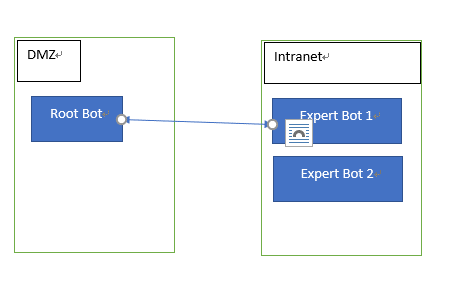
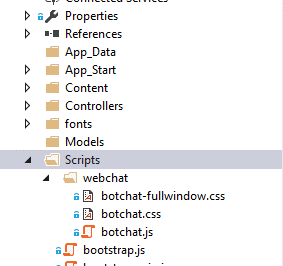
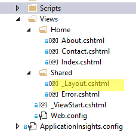

Bot-to-Bot Handover
===================

This document introduces how to implement Bot-to-Bot handover in Microsoft Bot
Framework. A typical Bot-to-bot scenario such as Alexa and its Skills. A “root
bot” (Alexa) handling conversation with end users, when certain keyword are
triggered, the “root bot” redirect user messages to corresponding backend
“expert bot” to assist end users.

How to use
----------

In this document, we will be providing working sample codes that illustrate how
to implement a “root bot” that accept user messages and provide a list of
integrated backend “expert bot”. When use select a expert bot he wants to
communicate with, the “root bot” forward all following messages to the backend
“expert bot”. User can then use a pre-defined “keyword” to return to “root bot”

This document is intending to provide instruction for enterprises to create
their internal bot consumed by internal users via WebChat control. Some codes or
considerations may not fit to consumer bot scenario. 3rd party IM app such as
Skype, Facebook messengers…etc may not be able to use in this scenario.

We assume you have basic Microsoft Bot Frmaework knowledge including how to
register Bot in Bot Framework portal and how to develop a Bot.

Architecture
------------

Below illustrate high-level architecture

1.  Root bot sitting in DMZ where Bot Connector Service can access to it via
    internet

2.  Expert Bots (HR Bot, FIN Bot…etc) sitting in intranet where Root Bot has
    access to.

3.  User first talk to Root Bot, when he wants to talk to HR Bot, Root Bot
    forward incoming messages to backend Expert Bot.

Next Steps
----------

### Create Root Bot

1.  Create Root Bot and register Root Bot in Bot Framework Developer Portal.
    Once created, create Directline channel and note down Directline secret.

2.  Download Bot Framework [Visual Studio project
    template](http://aka.ms/bf-bc-vstemplate)

3.  Follow instruction
    [here](https://docs.microsoft.com/en-us/bot-framework/dotnet/bot-builder-dotnet-quickstart)
    to create a Bot Application project called “DispatcherBot” in Visual Studio.

4.  DispatcherBot is in charge of forwarding messages to corresponding backend
    expert bot. We will implementing

    -   A DataSource class which contains all backend expert bot information so
        that DispatcherBot knows where to forward messages to

    -   A forwarding logic so that it knows when to forward

        1.  In this sample, we will be storing forwardingUrl in
            ConversationData. Everytime when DispatcherBot receives a message,
            it check if forwardingUrl exists, if so, it forward messages to
            corresponding expert bot URL. Otherwise it handles that message
            locally.

5.  Now, open MessagesController.cs. In Post() function, add below codes

public async Task\<HttpResponseMessage\> Post([FromBody]Activity activity)

{

string conversationID = activity.Conversation.Id;

StateClient stateClient = activity.GetStateClient();

BotData conversationData = await stateClient

>   .BotState

>   .GetConversationDataAsync(

>   activity.ChannelId,

>   conversationID);

// The URL of the currently active bot, either main or one of the sub bots.

var forwardingUrl =
conversationData.GetProperty\<string\>(Consts.ForwardingUrlKey);

1.  Next we check if incoming messages are of type Message. When user says the
    trigger word of a certain backend expert bot (such as HR Bot), or we
    configured the client to be a HR BOT (this is configured via setting
    Activity.channelData.clientName property). We retrieve forwarding Url and
    set this url to conversation data. (the forwarding url is the url of expert
    bot’s entry point, typically where\>/api/messages.

if (activity.Type == ActivityTypes.Message)

{

var message = activity as IMessageActivity;

if(message != null && !string.IsNullOrEmpty(message.Text))

{

>   dynamic client = (dynamic)(activity.ChannelData);

>   string clientName = (string)client.clientName;

>   var commandUrl = (from cmd in DataSource.RegisteredBots

>   where
>   message.Text.Equals(cmd.Key,StringComparison.InvariantCultureIgnoreCase)
>   \|\| (!string.IsNullOrEmpty(clientName) && clientName.Equals(cmd.Key,
>   StringComparison.InvariantCultureIgnoreCase))

>   select cmd.Value).FirstOrDefault();

>   if(commandUrl != null && !string.IsNullOrEmpty(commandUrl))

{

>   forwardingUrl = commandUrl;

>   conversationData.SetProperty\<string\>(Consts.ForwardingUrlKey,
>   forwardingUrl);

>   await stateClient.BotState.SetConversationDataAsync(

>   activity.ChannelId, conversationID, conversationData);

>   }

}

}

1.  If we do not have forwardingUrl retrieved, meaning that this message is to
    be handled locally in root Bot

if (string.IsNullOrEmpty(forwardingUrl) \|\|
Request.RequestUri.ToString().Equals(forwardingUrl,StringComparison.InvariantCultureIgnoreCase))

{

if(activity.Type == ActivityTypes.Message)

{

>   await Conversation.SendAsync(activity, () =\> new RootDialog());

}

else

{

>   HandleSystemMessage(activity);

}

>   var response = Request.CreateResponse(HttpStatusCode.OK);

return response;

}

1.  If we do have forwardingUrl, we do forwarding here

var http = new HttpClient();

var request = new HttpRequestMessage

{

RequestUri = new Uri(forwardingUrl),

Method = HttpMethod.Post

};

try

foreach (var header in Request.Headers)

{

>   request.Headers.Add(header.Key, header.Value);

}

request.Headers.Host = request.RequestUri.Host;

var json = JsonConvert.SerializeObject(activity);

var content = new StringContent(json, Encoding.UTF8, "application/json");

request.Content = content;

var resp = await http.SendAsync(request);

return resp;

}

catch (Exception exp)

{

throw;

}

1.  Your code should looks like below

public async Task\<HttpResponseMessage\> Post([FromBody]Activity activity)

{

string conversationID = activity.Conversation.Id;

StateClient stateClient = activity.GetStateClient();

BotData conversationData = await
stateClient.BotState.GetConversationDataAsync(activity.ChannelId,
conversationID);

var forwardingUrl =
conversationData.GetProperty\<string\>(Consts.ForwardingUrlKey);

if (activity.Type == ActivityTypes.Message)

{

var message = activity as IMessageActivity;

if(message != null && !string.IsNullOrEmpty(message.Text))

{

dynamic client = (dynamic)(activity.ChannelData);

string clientName = (string)client.clientName;

var commandUrl = (from cmd in DataSource.RegisteredBots

where message.Text.Equals(cmd.Key, StringComparison.InvariantCultureIgnoreCase)

\|\| (!string.IsNullOrEmpty(clientName) && clientName.Equals(cmd.Key,
StringComparison.InvariantCultureIgnoreCase))

select cmd.Value).FirstOrDefault();

if(commandUrl != null && !string.IsNullOrEmpty(commandUrl))

{

forwardingUrl = commandUrl;

conversationData.SetProperty\<string\>(Consts.ForwardingUrlKey, forwardingUrl);

await stateClient.BotState.SetConversationDataAsync(activity.ChannelId,
conversationID, conversationData);

}

}

}

if (string.IsNullOrEmpty(forwardingUrl) \|\|
Request.RequestUri.ToString().Equals(forwardingUrl,StringComparison.InvariantCultureIgnoreCase))

{

if(activity.Type == ActivityTypes.Message)

{

await Conversation.SendAsync(activity, () =\> new RootDialog());

}

else

{

HandleSystemMessage(activity);

}

var response = Request.CreateResponse(HttpStatusCode.OK);

return response;

}

else

{

var http = new HttpClient();

var request = new HttpRequestMessage

{

RequestUri = new Uri(forwardingUrl),

Method = HttpMethod.Post

};

try

{

foreach (var header in Request.Headers)

{

request.Headers.Add(header.Key, header.Value);

}

request.Headers.Host = request.RequestUri.Host;

var json = JsonConvert.SerializeObject(activity);

var content = new StringContent(json, Encoding.UTF8, "application/json");

var resp = await http.SendAsync(request);

return resp;

}

catch (Exception exp)

{

throw;

}

}

}

1.  Now, create a DataSource.cs which will retrieve Bot registration information
    from database, in this sample code I am just using a mock datasource class
    where have everything hard-coded.

>   **NOTE**: As mentioned, we will be configuring each bot using Root Bot’s
>   AppId and AppPassword

using System;

using System.Collections.Generic;

using System.Linq;

using System.Web;

namespace DispatcherBot.Models

{

/// \<summary\>

/// This is a mock datasource class, you should change below codes to actually
retrieve BOT information from your choosen storage

/// \</summary\>

public class DataSource

{

public static Dictionary\<string, string\> RegisteredBots = new
Dictionary\<string, string\>

{

{ "IT BOT","http://\<IT URL\>/api/messages" },

{ "HR BOT","https://\
/api/messages"},

{ "Main BOT","https://\<Main URL\>/api/messages"}

};

public static Dictionary\<string, KeyValuePair\<string, string\>\>
RegisteredBotSecrets = new Dictionary\<string, KeyValuePair\<string, string\>\>

{

{ "IT BOT", new KeyValuePair\<string,string\>("\<Root bot AppId","Root bot
AppPassword") },

{ "HR BOT", new KeyValuePair\<string,string\>("\<Root bot AppId","Root bot
AppPassword") },

};

}

}

1.  Next, we will be creating a HeroCard to allow users choose which expert bot
    they’d like to talk to.

Update your RootDialog.cs as below

[Serializable]

public class RootDialog : IDialog\<object\>

{

public Task StartAsync(IDialogContext context)

{

context.Wait(MessageReceivedAsync);

return Task.CompletedTask;

}

private async Task MessageReceivedAsync(IDialogContext context,
IAwaitable\<IMessageActivity\> result)

{

var message = await result;

// If the message matches a navigation command, take the correct action (post
something to the conversation, call a dialog to change the conversation flow,
etc.

if (message.Text.ToLowerInvariant() ==
Models.Consts.MainBotKey.ToLowerInvariant())

{

await this.ShowNavMenuAsync(context);

}

else

{

// Else something other than a navigation command was sent, and this dialog only
supports navigation commands, so explain the bot doesn't understand the command.

await this.StartOverAsync(context, string.Format("I don't understand",
message.Text));

}

}

private async Task ShowNavMenuAsync(IDialogContext context)

{

var reply = context.MakeMessage();

var menuHeroCard = new HeroCard

{

Text = \$"Hi, {context.Activity.From.Name}
({context.Activity.From.Id})::{JsonConvert.SerializeObject(context.Activity)}",

Buttons = DataSource.RegisteredBots.Where(r =\> r.Key !=
Consts.MainBotKey).Select(b =\> new CardAction(ActionTypes.ImBack, b.Key, value:
b.Key)).ToList\<CardAction\>()

};

reply.Attachments.Add(menuHeroCard.ToAttachment());

await context.PostAsync(reply);

context.Wait(this.ShowNavMenuResumeAfterAsync);

}

private async Task ShowNavMenuResumeAfterAsync(IDialogContext context,
IAwaitable\<IMessageActivity\> result)

{

var message = await result;

// If we got here, it's because something other than a navigation command was
sent to the bot (navigation commands are handled in NavigationScorable
middleware),

// and this dialog only supports navigation commands, so explain bot doesn't
understand the message.

await this.StartOverAsync(context, string.Format("I don't understand {0}",
message.Text));

}

private async Task StartOverAsync(IDialogContext context, string text)

{

var message = context.MakeMessage();

message.Text = text;

await this.StartOverAsync(context, message);

}

private async Task StartOverAsync(IDialogContext context, IMessageActivity
message)

{

await context.PostAsync(message);

await this.ShowNavMenuAsync(context);

}

}

1.  Compile and publish DispatcherBot

### Create HR Bot

Creating an expert bot is nothing but to create a regular Microsoft Bot
Framework Bot with Bot Builder SDK. In this sample we simply echo everything
users says back to user.

1.  Create a new Bot Application project in Visual Studio

2.  Update MessageReceivedAsync() in RootDialog.cs as below

private async Task MessageReceivedAsync(IDialogContext context,
IAwaitable\<object\> result)

{

var activity = await result as Activity;

// calculate something for us to return

int length = (activity.Text ?? string.Empty).Length;

// return our reply to the user

await context.PostAsync(\$"You're in HR system, type \\"Main Bot to
return\\"{activity.Text}");

context.Wait(MessageReceivedAsync);

}

1.  Publish and deploy your bot

Create a Chatbot Client page
----------------------------

In this step we will be creating an ASP.NET MVC website to host our Webchat
control.

1.  Create a ASP.Net MVC Web Application in Visual Studio

2.  Follow steps described
    [here](https://github.com/Microsoft/BotFramework-WebChat#building-webchat)
    to compile WebChat control

    -   It will generate botchat.js, botchat.css, botchat-fullwindow.css in
        source root folder. Copy down these generated files and paste them to
        your ASP.NET MVC website’s webchat folder under Scripts folder

1.  Open Shared\\_Layout.cshtml, we will be adding compatible declarative to the
    page.

1.  Add below declarative

\<!DOCTYPE html PUBLIC "-//W3C//DTD XHTML 1.0 Strict//EN"
"http://www.w3.org/TR/xhtml1/DTD/xhtml1-strict.dtd"\>

\<html\>

\<head\>

\<meta charset="utf-8" /\>

\<meta name="viewport" content="width=device-width, initial-scale=1.0"\>

\<meta http-equiv="X-UA-Compatible" content="IE=11" /\>

\<title\>\@ViewBag.Title - My ASP.NET Application\</title\>

\@Styles.Render("\~/Content/css")

\@Scripts.Render("\~/bundles/modernizr")

\<link href="\~/Scripts/webchat/botchat.css" rel="stylesheet" /\>

\<script src="\~/Scripts/webchat/botchat.js"\>\</script\>

\</head\>

1.  Add below script to Index.cshtml.

>   **NOTE**: In order to be able to publish HR Bot to HR’s website to allow
>   user directly interact with HR Bot from HR Web site instead of having them
>   talk to Root Bot first. Here we add a “clientName” property to channelData
>   so that our DispatcherBot can check if we need to forwarding everything to
>   HR Bot.

\

\<script src="\~/Scripts/webchat/botchat.js"\>\</script\>

\<script\>

var userLang = navigator.language \|\| navigator.userLanguage;

var nVer = navigator.appVersion;

var nAgt = navigator.userAgent;

var browserName = navigator.appName;

var OSName = "Unknown OS";

if (navigator.appVersion.indexOf("Win") != -1) OSName = "Windows";

if (navigator.appVersion.indexOf("Mac") != -1) OSName = "MacOS";

if (navigator.appVersion.indexOf("X11") != -1) OSName = "UNIX";

if (navigator.appVersion.indexOf("Linux") != -1) OSName = "Linux";

var os = { version: nVer, agent: nAgt, browser: browserName, os: OSName };

var secret = {

secret: '-aJnKkHwYC0.cwA.-k8.rvLYTuVmkPNOZ215gN1FY37wIBKDK6dyDkMOG53ckV8'

}

var dl = new BotChat.DirectLine(secret);

//In Javascript ES6, we could use {...dl,
postActivity:activity=\>{...activity,activity.channelData.test
='ok';dl.postActivity(activity);}

//To Clone a BotConnection Object and assign in BotChat.App constructor

//However, In IE we are unable to use above syntax, istead, we need to override
postActivity() using below codes

var mock = new BotChat.DirectLine(secret);

mock._postActivity = dl.postActivity;

mock.postActivity = function (activity) {

activity.channelData.os = os;

activity.channelData.clientName = 'HR BOT';

activity.channelData.language = userLang;

return mock._postActivity(activity);

}

BotChat.App({

botConnection: mock,

user: { id: 'michael-chi' },

bot: { id: 'auo root bot' },

resize: 'detect'

}, document.getElementById("bot"));

\</script\>

1.  Publish the website.

See it in Action!
-----------------

1.  Login to your WebChat website

1.  Open your HR Website

